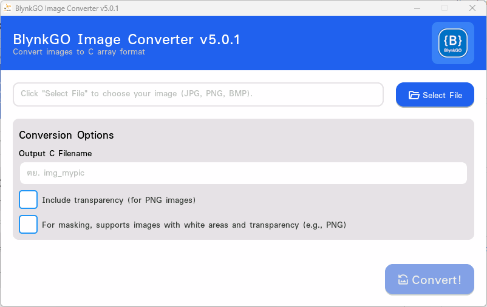

# BlynkGO_ImageConverter5
 ตัวแปลงรูป JPG, PNG, BMP เป็น C array สำหรับ BlynkGOv5  

## Download
https://github.com/BlynkGO/BlynkGO_ImageConverter5/releases/download/v5.0.0/BlynkGO_ImgConverter5.zip
  
## ตัวอย่างหน้าจอ



## วิธีใช้
- นำรูป (JPG, PNG, BMP) ไปวางไว้ในโปรเจค ภายใต้ โฟลเดอร์ src  
  โดยอาจสร้างเป็น folder ย่อยที่ชือว่า src/images ไว้เก็บรูป
- กดปุ่ม `Select File` เพื่อเลือกรูปที่ต้องการแปลง (JPG, PNG, BMP)
- ตั้งชื่อที่จะแปลง ในช่อง `Output C Filename` โดยไม่ต้องใส่ .c
- หากรูปไหน ต้องการแปลงแบบโปร่งใสด้วย ให้ ติ๊กเลือก `Include transparency (for PNG images)`
- กดปุ่ม `Convert!`  รูปที่ได้ จะนามสกุล .c ให้ และอยู่ในโฟลเดอร์ ภายใต้ src ให้อัตโนมัติ

## ตัวอย่างโคด

หากรูปที่แปลงได้ มีชื่อว่า img_mypic.c และอยู่ ในโฟลเดอร์ภายใต้ src ของโปรเจคแล้ว

```c
#include <BlynkGOv5.h>

IMAGE_DECLARE(img_mypic);   // ประกาศทั่วระบบกราฟิก ว่ามี ทรัพยากรรูป C array เข้ามาเพิ่ม

GImage mypic(img_mypic);    // ประกาศวิตเจ็ต GImage โดย วิตเจ็ตมีชื่อว่า mypic และโหลดใช้รูปด้วย img_mypic

void setup(){
  Serial.begin(9600); Serial.println();
  BlynkGO.begin();

  mypic.position(10,10);    // นำไปจัดวางตำแหน่งที่ต้องการ
}

void loop(){
  BlynkGO.update();
}
```
