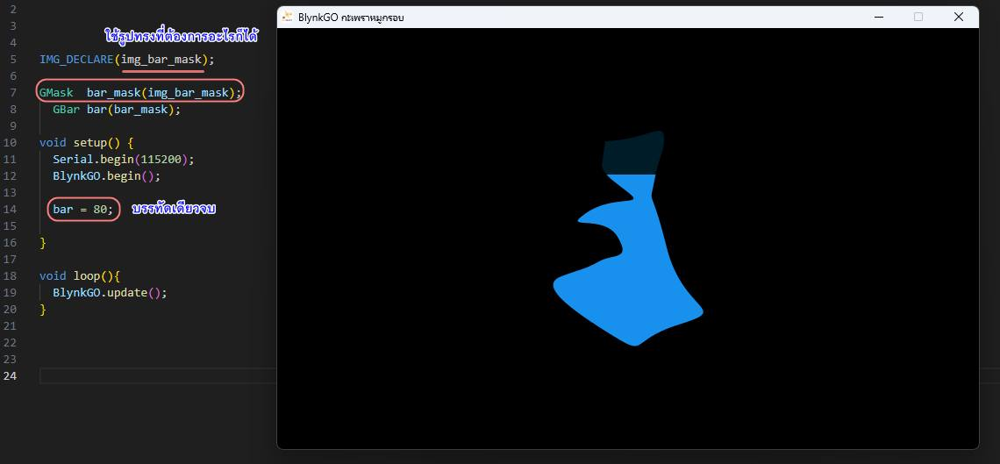

# BlynkGO Image Converter v5
 ตัวแปลงรูป JPG, PNG, BMP เป็น C array สำหรับ BlynkGOv5  

## Download
*version 5.0.1*  
https://github.com/BlynkGO/BlynkGO_ImageConverter5/releases/download/v5.0.1/BlynkGO_ImgConverter5.0.1.zip
  
## ตัวอย่างหน้าจอ


## วิธีใช้
- นำรูป (JPG, PNG, BMP) ไปวางไว้ในโปรเจค ภายใต้ โฟลเดอร์ src  
  โดยอาจสร้างเป็น folder ย่อยที่ชือว่า src/images ไว้เก็บรูป
- กดปุ่ม `Select File` เพื่อเลือกรูปที่ต้องการแปลง (JPG, PNG, BMP)
- ตั้งชื่อที่จะแปลง ในช่อง `Output C Filename` โดยไม่ต้องใส่ .c
- หากรูปไหน ต้องการแปลงแบบโปร่งใสด้วย ให้ ติ๊กเลือก `Include transparency (for PNG images)`
- หากรูปที่ไว้สำหรับทำ mask วิตเจ็ต เพื่อให้วิตเจ็ตที่ถูก mask แสดงเฉพาะตามรูปทรงที่ต้องการ  
  ให้สร้างรูป PNG ที่มีพื้นที่สีขาวที่มีตามรูปทรงที่ต้องการ แล้วให้ส่วนอื่นๆ เป็นโปร่งใส  
  และให้มาแปลงโดย ติ๊กเลือก `For masking, supports images with white areas and transparency (e.g., PNG)`  
- กดปุ่ม `Convert!`  รูปที่ได้ จะนามสกุล .c ให้ และอยู่ในโฟลเดอร์ ภายใต้ src ให้อัตโนมัติ

## ตัวอย่างโคด (1) : วิตเจ็ตรูป GImage 

หากรูปที่แปลงได้ มีชื่อว่า img_mypic.c และอยู่ ในโฟลเดอร์ภายใต้ src ของโปรเจคแล้ว

```c
#include <BlynkGOv5.h>

IMAGE_DECLARE(img_mypic);   // ประกาศทั่วระบบกราฟิก ว่ามี ทรัพยากรรูป C array เข้ามาเพิ่ม

GImage mypic(img_mypic);    // ประกาศวิตเจ็ต GImage โดย วิตเจ็ตมีชื่อว่า mypic และโหลดใช้รูปด้วย img_mypic

void setup(){
  Serial.begin(9600); Serial.println();
  BlynkGO.begin();

  mypic.position(10,10);    // นำไปจัดวางตำแหน่งที่ต้องการ
}

void loop(){
  BlynkGO.update();
}
```

## ตัวอย่างโคด (2) : วิตเจ็ตรูป GImage กำหนดรูปด้วย = 

หากรูปที่แปลงได้ มีชื่อว่า img_mypic.c และอยู่ ในโฟลเดอร์ภายใต้ src ของโปรเจคแล้ว

```c
#include <BlynkGOv5.h>

IMAGE_DECLARE(img_mypic);   // ประกาศทั่วระบบกราฟิก ว่ามี ทรัพยากรรูป C array เข้ามาเพิ่ม

GImage mypic;               // ประกาศวิตเจ็ต GImage โดย วิตเจ็ตมีชื่อว่า mypic

void setup(){
  Serial.begin(9600); Serial.println();
  BlynkGO.begin();

  mypic = img_mypic;       // กำหนดรูปที่จะใช้ให้วิตเจ็ต ด้วย =
}

void loop(){
  BlynkGO.update();
}
```


## ตัวอย่างโคด (3)  : วิตเจ็ตปุ่มด้วยรูป GImageButton 

หากรูปที่แปลงได้ มีชื่อว่า img_mypic.c และอยู่ ในโฟลเดอร์ภายใต้ src ของโปรเจคแล้ว

```c
#include <BlynkGOv5.h>

IMAGE_DECLARE(img_mybutton);          // ประกาศทั่วระบบกราฟิก ว่ามี ทรัพยากรรูป C array เข้ามาเพิ่ม

GImageButton mybutton(img_mybutton);  // ประกาศวิตเจ็ตปุ่มรูปภาพ GImageButton โดย วิตเจ็ตมีชื่อว่า mybutton โดยใช้รูป img_mybutton

void setup(){
  Serial.begin(9600); Serial.println();
  BlynkGO.begin();

  mybutton.onClicked([](GWIDGET){
    Serial.println("Clicked");
  });
}

void loop(){
  BlynkGO.update();
}
```

## ตัวอย่างโคด (4)  : วิตเจ็ตปุ่มด้วยรูป GImageButton แบบใช้ 2 รูป

หากรูปที่แปลงได้ มีชื่อว่า img_button_released.c  และ img_button_pressed.c และอยู่ ในโฟลเดอร์ภายใต้ src ของโปรเจคแล้ว

```c
#include <BlynkGOv5.h>

IMAGE_DECLARE(img_button_released);       // ประกาศทั่วระบบกราฟิก ว่ามี ทรัพยากรรูป C array เข้ามาเพิ่ม สำหรับใช้เป็นปุ่มขณะปล่อย
IMAGE_DECLARE(img_button_pressed);        // ประกาศทั่วระบบกราฟิก ว่ามี ทรัพยากรรูป C array เข้ามาเพิ่ม สำหรับใช้เป็นปุ่มขณะกด

// ประกาศวิตเจ็ตปุ่มรูปภาพ GImageButton โดย วิตเจ็ตมีชื่อว่า mybutton
// โดยใช้รูป 2 รูป รูปนึงเป็นตอนปุ่มปล่อย อีกรูปเป็นตอนปุ่มถูกกด
GImageButton mybutton(img_button_released, img_button_pressed);  

void setup(){
  Serial.begin(9600); Serial.println();
  BlynkGO.begin();

  mybutton.onClicked([](GWIDGET){
    Serial.println("Clicked");
  });
}

void loop(){
  BlynkGO.update();
}
```
  
## ตัวอย่างโคด (5) : วิตเจ็ตปุ่มด้วยรูป GImageButton มาทำเป็น switch เปิดปิด แบบใช้ 2 รูป

หากรูปที่แปลงได้ มีชื่อว่า img_switch_off.c  และ img_switch_on.c และอยู่ ในโฟลเดอร์ภายใต้ src ของโปรเจคแล้ว

```c
#include <BlynkGOv5.h>

IMAGE_DECLARE(img_switch_off);       // ประกาศทั่วระบบกราฟิก ว่ามี ทรัพยากรรูป C array เข้ามาเพิ่ม สำหรับใช้เป็นปุ่มขณะ OFF
IMAGE_DECLARE(img_switch_on);        // ประกาศทั่วระบบกราฟิก ว่ามี ทรัพยากรรูป C array เข้ามาเพิ่ม สำหรับใช้เป็นปุ่มขณะ ON

// ประกาศวิตเจ็ตปุ่มรูปภาพ GImageButton โดย วิตเจ็ตมีชื่อว่า myswitch
// ทำเป็นสวิตซ์ กดเปิดปิด โดยใช้รูป 2 รูป รูปนึงเป็นตอนปุ่ม OFF อีกรูปเป็นตอนปุ่ม ON
GImageButton myswitch(BUTTON_SWITCH, img_switch_off, img_switch_on);  

void setup(){
  Serial.begin(9600); Serial.println();
  BlynkGO.begin();

  myswitch.onValueChanged([](GWIDGET){
    if(myswitch.isON()){   // เช็คสถานะว่า สวิตซ์ มีสถานะ ON อยู่ หรือไม่
       Serial.println("[Switch] ON");
    }else{
       Serial.println("[Switch] OFF");
    }
  });
}

void loop(){
  BlynkGO.update();
}
```
  
## ตัวอย่างโคด (6) : วิตเจ็ตมาสก์ GMask ทำการมาสก์วิตเจ็ตลูกๆด้วยรูปทรงที่ต้องการ

ให้สร้างรูป PNG ที่มีพื้นที่สีขาว ตามรูปทรงที่ต้องการ และส่วนอื่นๆ เป็นพื้นที่โปร่งใส  
แล้วนำมาแปลงโดยเลือกติ๊ก `For masking ...`  
หากได้รูปที่ไว้มาส์ก นี้ ไฟล์ img_bar_mask.c ออกมา และอยู่ภายใต้โฟลเดอร์ src แล้ว  

```c
#include <BlynkGOv5.h>

IMAGE_DECLARE(img_bar_mask);

GMask bar_mask(img_bar_mask);
  GBar bar(bar_mask);           // bar จะถูกมาสก์ให้เห็นเหลือตามรูปทรงที่ต้องการ

void setup(){
  Serial.begin(9600); Serial.println();
  BlynkGO.begin();

  bar = 80;
}

void loop(){
  BlynkGO.update();
}
```
  
  
  


